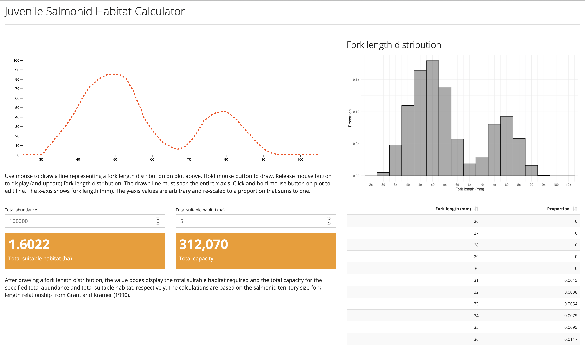

## Juvenile Salmonid Habitat Calculator

A [web app](https://fishsciences.shinyapps.io/juvenile-salmonid-habitat-calculator/) built with the [Shiny web framework for R](https://shiny.rstudio.com). The app uses the [shinysense](https://github.com/nstrayer/shinysense) package to allow the user to free draw a fork length distribution that is used in the habitat calculations.

